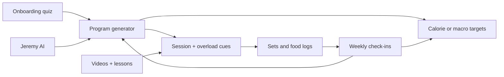

# Built With Science+ vs Signal

> Competitive research + gap backlog. Repo = Helm; user-facing product = **Signal**.
> Sources: App Store / Play listing, BWS support articles (food logging, nutrition check-in, Jeremy AI, wearables), public reviews/walkthroughs (2026), Signal code + `Docs/DESIGN-SYSTEM.md`.
> Not training-engine truth - that stays in `RECONCILE.md`.

## Verdict

BWS+ does **not** beat Signal on adaptive math or HealthKit depth. It beats Signal on **guided coach product**: one next action, form education, weekly ritual, progress storytelling, and visual hierarchy.

Signal’s engines are often stronger. The **product layer** is where Signal falls.

---

## How BWS+ works

Mass-market **all-in-one coach subscription** (~$30/mo or ~$189/yr, 14-day trial). Founder-led (Jeremy Ethier) + research team (e.g. Trexler). Evolved from PDF/spreadsheet programs into one app.

### Loop (concrete)

1. **Assessment quiz** - goal (fat loss / muscle / recomp), experience, equipment, days/week, body stats, lifestyle → generates split + exercise pool + volume.
2. **Session coaching** - prescribed load/reps/rest; log actuals; **explicit progressive overload** next session (“add 5 lb / add a rep / hold”).
3. **Nutrition** - targets from goal; food log via search (2M+ foods), barcode, AI plate photo, quick macros, meals/recipes; logs feed **weekly nutrition check-in**.
4. **Weekly nutrition check-in** - needs ≥3 weigh-ins + ≥3 food days in last 7; drops days under 80% of goal as incomplete; confidence tiers (high / moderate / needs data); recalculates TDEE from avg intake + weight change → new calorie target. MacroFactor-class math, productized as a **ritual**.
5. **Modifiers** - Muscle Group Prioritizer (volume redistribution); Recomp Detector (scale-flat but body comp moving); step goals via Apple Health / Health Connect (**steps only**, not wearable calorie burn).
6. **AI** - Jeremy AI: chat + **async program generate/modify** (5-10 min); grounded in BWS content + user data. Separate from support chatbot.
7. **Education product** - 250+ exercise videos (setup, mistakes, why); 200+ daily lessons; recipes; optional cookbook / coaching / hardware.

### Information architecture

Bottom tabs (from user walkthroughs): Workout schedule, Nutrition, Progress (weight + strength trends), Lessons. **One clear job per tab.** Home always answers “what do I do today.”

### What BWS+ is not

- Deep readiness / HRV autoregulation
- Rich wearable strain
- Watch live-session brain
- N-of-1 pattern engines

Wearable = steps. Programming is adaptive but **program-first**, not recovery-gated daily.

---

## Signal today (capability truth)

Positioning (`README.md`, `Docs/DESIGN-SYSTEM.md`): *closed-loop adaptive prescription* - engines own numbers; LLM narrates/negotiates inside clamps. Design thesis: **“instrument, not an app.”**

| Domain | Signal strength |
|--------|-----------------|
| Readiness | ARC from HealthKit (HRV / RHR / sleep / TRIMP) → gates prescription |
| Training | PlanKit meso (MEV→MRV), drift, e1RM progression, Hevy-class logger, Watch session |
| Nutrition | Adaptive TDEE + weekly budget, CoFID / OFF / barcode / photo / LiDAR, day-complete |
| Coach | Gemini tools that **mutate** food / workout / plan / settings (richer than Jeremy AI chat-only) |
| Patterns | PatternKit N-of-1 (data-gated) |

**Thin vs BWS+:** exercise video/form library, lesson curriculum, recipe library, recomp storytelling UI, muscle-prioritizer as first-class modifier, consumer onboarding, Progress-as-story tab.

---

## Feature matrix

| Capability | BWS+ | Signal | Verdict |
|------------|------|--------|---------|
| Personalized program from quiz | Strong | Plan builder exists; feels power-user | BWS wins polish |
| Session-by-session overload copy | Explicit coach voice | Engine decisions + detail screens; quieter | BWS wins clarity |
| Adaptive TDEE / weekly adjust | Ritual check-in + confidence | Engine continuous + day-complete | **Parity on math**; BWS wins ritual UX |
| Food logging breadth | Strong commercial DB + AI scan + recipes | Strong native + photo/LiDAR; thinner recipes | Near parity; BWS wins recipes/DB polish |
| Exercise form education | 250+ videos core product | Placeholder catalog + cues; ExplainSheet for numbers | **BWS wins hard** |
| Daily education | 200+ lessons | Methodology browser (thin) | BWS wins |
| AI coach | Persona + program gen | Tool-using coach + clamps | **Signal wins power**; BWS wins feel |
| Recovery / readiness | Weak (steps) | Core wedge | **Signal wins hard** |
| Watch / live HR session | Light | Real companion | Signal wins |
| Progress storytelling | Dedicated Progress tab, recomp detector | Progress tab + journey/recomp cards; PR still thin | Near parity on hub; BWS still wins form/content depth |
| Visual warmth / hierarchy | Guided consumer | Cockpit / HUD / equal-weight cards | **BWS wins hard** |

**Bottom line:** BWS+ packages good-enough adaptive programming + nutrition + content into a **guided product**. Signal’s engines are often stronger; the **product layer** is the gap.

---

## UI/UX gap (why Signal falls hard)

**BWS+ product grammar:** outcome → one next action → guided logging → weekly story.

**Signal product grammar:** telemetry panel → many equal cards → power-user escape hatches.

| # | Mismatch | Evidence |
|---|----------|----------|
| 1 | Dashboard density | `Helm/Views/DashboardView.swift` stacks brief, ARC, sleep, session, volume, nutrition, trends as peers. BWS hero = today’s workout / check-in. |
| 2 | Onboarding | Signal now: Welcome → plan → body → Health → ready; Hevy CSV + 6-month backfill live in Settings. BWS still smoother quiz polish. |
| 3 | Choice overload | Train empty/paste/import; Nutrition multi-path FAB + tip card. BWS defaults one path. |
| 4 | No form/content surface | BWS Lessons + per-exercise video. Signal assumes competence; coach explains metrics not movement. |
| 5 | Celebration / journey | Phase narrative + recomp dual-signal on Progress (and Dashboard when storyful). Streaks/milestones still thin. |
| 6 | Visual language | Instrument card baseline is the product UI. Tron HUD (`signal` skin) remains advanced-only backup; not the live default. BWS reads lifestyle coach. |
| 7 | Discoverability | Program phase/equipment buried in Settings/sheets; BWS keeps “your plan” obvious on Workout tab. |

**Design rule:** Do **not** throw away the instrument thesis. Add a **coach-product layer on top** (hero CTA, narrative, progressive disclosure, form help). Do not become a content CMS clone of Ethier’s YouTube library.

---

## Prioritized backlog

### P0 - Feel like a coach product (highest ROI vs BWS)

1. **Single “do this now” hero on Dashboard** - Today’s session *or* nutrition check-in as dominant; ARC / volume / trends demoted or collapsed.
2. **Consumer-first onboarding** - Goals → plan promise → first session; defer Hevy CSV + long backfill to Settings.
3. **Guided workout layer** - Per-exercise: short cue text + optional demo (YouTube/bundled later); rest coaching copy; “next load/reps” in plain language on set row (surface Progression decisions as coach voice).
4. **Nutrition default path** - One primary log action (recent + photo/barcode); park search/describe/alcohol/templates behind “More.”
5. **Weekly ritual UI** - Explicit nutrition + training week check-in sheet (confidence, include/exclude days) wrapping existing TDEE/budget engines - steal BWS *ritual*, keep Signal math.

### P1 - Progress storytelling

6. **Progress hub** (tab or Dashboard first-class) - weight trend, strength/e1RM, recomp-style dual signal (scale vs BF/volume), phase week label (“Week 3 · hypertrophy”).
7. **Muscle prioritizer UX** - thin UI over PlanKit volume redistribution (BWS feature users notice).
8. **Warm empty states** - actionable first-week scaffolding, not “Nothing logged.”

### P2 - Content without building a media company

9. **Exercise media MVP** - cues + external/demo links for prescription exercises; not 250 custom films day one.
10. **Inline explain** - promote ExplainSheet snippets onto readiness/nutrition/volume cards (coach voice without long-press).
11. **Recipes later / skip** - lowest wedge vs readiness loop; optional import or coach-suggested meals only.

### Explicit non-goals (don’t copy BWS)

- Subscription marketplace, cookbook SKUs, lesson CMS at BWS scale.
- Replacing readiness gating with static program blocks.
- Abandoning mono/instrument for generic purple fitness UI.

---

## Recommended first build slice

**Shipped (this pass):**

| Item | Status |
|------|--------|
| Design system | Instrument is default skin; Tron/signal kept as advanced backup; DESIGN-SYSTEM.md synced; orphan DS junk pruned |
| Dashboard hero (#1) | Hero = session / nutrition / brief; ARC/sleep/brief/nutrition stay visible; Volume & trends disclosure (expanded by default) |
| Nutrition default path (#4) | Photo + barcode primary; More for search/describe/etc.; tip softens after first log |
| Guided workout (#3) | LoadDecision athlete coaching lines on set headers; Progression linked from Train idle + Dashboard |
| Progression bars | Pass remaining-to-target as `scheduledSets` so LandmarkVolumeBar shows tint fill, not empty track |
| Train idle defaults | Empty/Paste under More when prescription exists |

**Still deferred:**

- Recipe/lesson CMS (explicit non-goal)

**Wave 1 rituals (in tree):**

- Nutrition weekly check-in sheet + Settings check-in day picker; rolling 7d reconcile
- Training week review on Train idle; shared weekday key `helm.nutrition.checkInWeekday`

**Wave 2 journey (in tree):**

- Progress tab hub (journey + recomp + trends + progression + patterns)
- Phase narrative formatter + recomp classifier/card
- Onboarding rewrite; Hevy/backfill deferred to Settings

**Wave 3 modifiers (in tree):**

- Train Your-plan strip; muscle focus chips → PlanKit weekly target redistrib
- Warm empties; ExplainSheet on Dashboard readiness + Train session volume

**Wave 4 form + celebration (in tree):**

- Exercise detail sheet (form cues + gif + history)
- Rest coaching lines during timer; expiry via proactive prefs
- Session quartile toasts + finish checkpoint recap (PR path unchanged)

**Wave 5 thin content (in tree):**

- Optional exercise `demoURL` on FORM (Open demo)
- Dashboard pattern teaser → findings
- Optional daily step goal (default off)

Build command examples (historical):

- `build BWS P0 slice` → hero + nutrition default + guided overload copy
- `build BWS P0.1` → Dashboard hero only
- `build BWS P0 all` → all five P0 items

