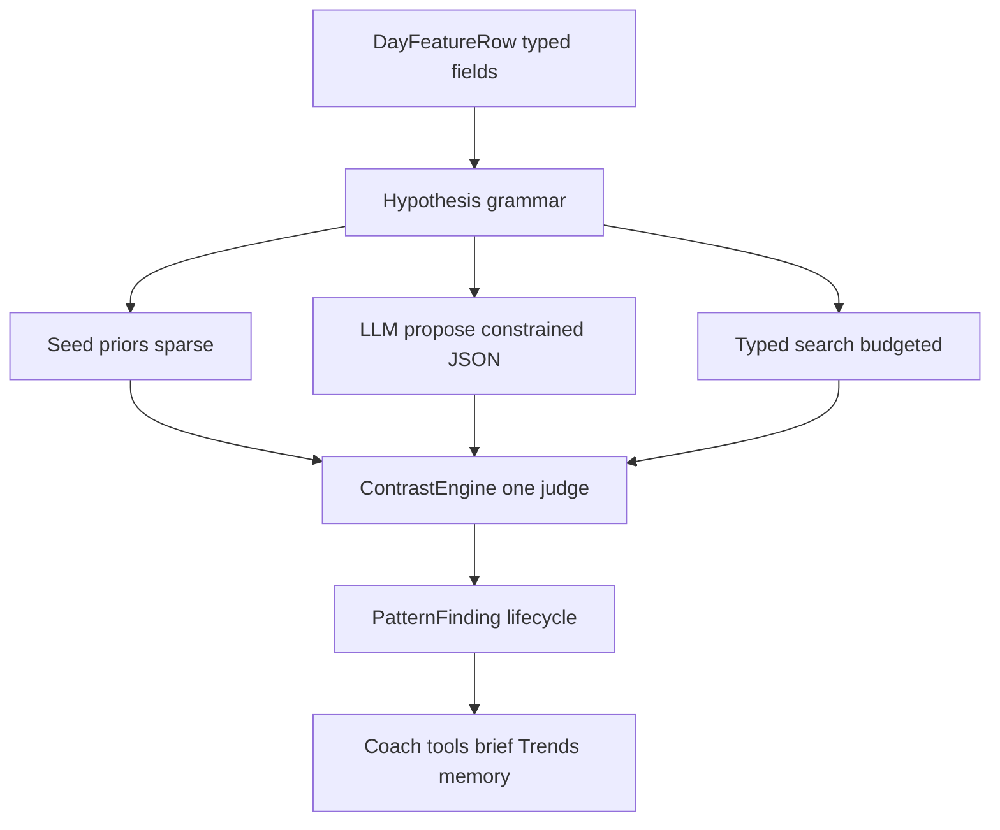

# Pattern detection for Signal - research verdict

> Spike date: 2026-09-03. Owner research for cross-factor “we noticed…” insights.
> Evidence: `scripts/pattern-spike/run_spike.py` → [`pattern-spike-results.json`](pattern-spike-results.json).
> Day matrix contract: [`../../scripts/pattern-spike/day_feature_schema.md`](../../scripts/pattern-spike/day_feature_schema.md).
> Engine truth remains [`RECONCILE.md`](RECONCILE.md). This file does not change PlanKit / ARC / NutritionKit behaviour.

## Problem (one paragraph)

Old Signal dumped long HealthKit history into a large model. Helm/Signal now has the data and engines, but no **cross-factor pattern layer**. Threshold insights and `trends_query` are univariate. Free-text `MemoryProfile.nutritionPatterns` is not measured. The product idea (“alcohol days you eat less”, “office days gym differs”) needs N-of-1 stats the coach can narrate without confabulating.

## Meta architecture (the actual product)

Alcohol / office / breakfast examples are **instances**, not the system. The system is a **hypothesis grammar + generators + one judge + a finding store**. Any future pattern Signal can notice must compile to the same shape and pass the same gates.



### 1. Feature space (typed columns, not special cases)

Every day is one `DayFeatureRow`. Fields are typed so the grammar knows legal ops:

| Type | Examples | Legal exposures |
|---|---|---|
| Binary / event | alcohol logged, breakfast present, training day, office tag | present vs absent |
| Continuous | kcal, protein, sleep min, HRV, RHR, mass, workout min, TRIMP | tertile / threshold / above baseline |
| Categorical / band | ARC band, day demand, meal-heavy vs light | level A vs rest / A vs B |
| Derived residual | performance given prescription, kcal given TDEE target | same as continuous |

New signals (travel, illness, Spotify late-night, etc.) = **new typed fields**. No new insight product. Meta layer stays.

### 2. Hypothesis grammar (one sentence shape)

```
Hypothesis :=
  exposure(field, op, params)
  × outcome(field, op?)
  × lag ∈ {0..L}
  × match? (weekday, training-day, same mesocycle phase, …)
```

Examples compile to the same AST:

| English | Grammar |
|---|---|
| Drink days you eat less | `alcohol=true` → `diet_energy` @ lag 0 |
| Office days gym differs | `demand=office` → `hevy_volume` or residual e1RM @ lag 0, match training-day |
| Breakfast → less protein | `breakfast=true` → `diet_protein` @ lag 0 |
| Bad sleep → next RHR up | `sleep tertile=low` → `resting_hr` @ lag 1 |
| Recovery in band X → better lifts | `arc_band=primed` → residual performance @ lag 0 |

Coach copy is just rendering the AST + stats. Engines never parse English.

### 3. Generators (how candidates appear - meta discovery)

Three intakes into the **same** judge. Not three products.

| Generator | Role | Budget |
|---|---|---|
| **Seed priors** | Tiny domain list + literature priors (cold start) | Fixed ~10–30 |
| **Propose-then-test** | LLM sees feature schema + summary stats (not raw rows); emits grammar JSON only | Cap K/week |
| **Typed search** | Enumerate legal `(exposure, outcome, lag)` under a score budget; never full cartesian of all floats | Cap M tests/rollover |

Open pairwise fishing of every metric × lag = kill. Typed + budgeted search = meta without false-discovery death.

Ranking before spend: prefer fields with coverage, prefer lag 0–1, prefer priors, prefer user-asked topics, demote tautologies (e.g. depleted → less volume when gating already cut volume).

### 4. One judge (ContrastEngine)

For every candidate, identical pipeline:

1. Build exposure/control day sets from the AST.
2. Pull outcome at lag (with match filters).
3. Effect (Cliff’s δ / median delta / optional Bayes with prior).
4. Min N gates (emerging vs stable).
5. Shuffle null + FDR across the **batch** of candidates that ran this cycle.
6. Tautology / engine-duplicate suppress.
7. Emit `PatternFinding` or discard.

LLM never invents the number. LLM may only propose the AST or narrate a stored finding.

### 5. Finding lifecycle (meta memory)

`emerging (n small)` → `stable` → `retired` (effect gone / contradicted) → optional user confirm into `MemoryProfile`.

Surfaces stay generic: `pattern_query`, findings-first context cards, brief line, Trends list. No per-example UI.

### 6. What “meta” deliberately is not

- Not a bigger Gemini context window over 90 raw days.
- Not one hardcoded alcohol insight screen.
- Not unsupervised “AI found 400 correlations”.
- Not auto-rewriting PlanKit from a finding (confirm posture first).

### Meta success test

If Cameron asks a new question (“when I travel does protein tank?”) Signal should: map to grammar → run judge (or say N too small) → store/narrate. **No code change beyond maybe a travel field.** That is the meta bar.

## Inputs used for the spike

| Source | Path | Role |
|---|---|---|
| Apple Health preprocess | `~/Downloads/apple_health_export 2/apple_health_out/daily_features.csv` | ~605 days sleep / HRV / diet / workouts / weight |
| Helm export (rich) | `~/Downloads/helm-2026-08-24T18-35-50Z.sqlite` | daily_metrics, sleep stages, readiness, sessions |
| Helm export (nutrition) | `~/Downloads/helm-2026-08-04T14-25-49Z.sqlite` | meals, buckets, nutrition_day, rare drink names |
| Hevy CSV | `~/Downloads/HevyExport 4.csv` | 260 training days volume |

Merged coverage after zero-diet cleanup: **925 calendar days** (2023-12-30 → 2026-08-24); diet days ~160; sleep ~850; HRV ~478; Hevy ~260; **alcohol-labeled days = 2**; **breakfast-tagged days = 6**; **office demand days = 0**; **ARC days = 12**.

## Method scorecard (stats)

Gates used in spike: ≥12 per arm, |Cliff’s δ| ≥ 0.15 for ship, BH-FDR q ≤ 0.10, 500 label shuffles.

| ID | Method | Verdict | Why |
|---|---|---|---|
| **A** | Hypothesis catalog + paired contrast | **Ship** | Matches “we noticed…” copy; inspectable; cheap on-device; survived on real sleep→RHR/HRV and related contrasts |
| **B** | Open pairwise mining | **Kill v1** | Multiple-testing + autocorrelation; fine as debug only |
| **C** | LLM over raw history | **Kill as truth** | Confabulates; battery; non-reproducible. Narrator only |
| **D** | Causal discovery / MoTR / DAGs | **Defer** | Research-grade; revisit after catalog trust |
| **E** | Anytime-valid / sequential Bayes | **Keep later** | Needed for small office/gym effects; not required for first shippable large effects |
| **F** | Stratified baselines | **Keep engine idea** | “Usual for this context” upgrade to ARC/nutrition baselines |

## AI efficiency methods (small setup)

Thesis: **engines compute; retrieval + tools feed a small prompt; LLM narrates and proposes.**

| ID | Method | Verdict | Battery / budget | Honesty | Signal role |
|---|---|---|---|---|---|
| **G** | Propose-then-test | **Ship (discovery loop)** | Tiny (JSON proposals) | High if gated | Coach proposes → ContrastEngine judges |
| **H** | Findings-first RAG | **Ship** | Low (cards not raw days) | High | Coach context / brief |
| **I** | Analogous-day feature vectors | **Soft later** | Cheap if hand features | Medium | “Days like today” |
| **J** | Literature Bayesian priors | **Ship cold-start** | Negligible | High if labeled | Alcohol→sleep before n is large |
| **K** | TimesFM / Chronos counterfactuals | **Defer on-phone** | Poor on-device today | Medium | Offline R&D only |
| **L** | Tool-thin agent | **Ship** | Already native | High | Add `pattern_query` / later `similar_days` |
| **M** | Micro-experiments | **Post-v1** | Product cost | High | Confirm like reactive deload |

**Kill as AI magic:** fine-tuned personal LLM on raw logs; on-device 4B+ for discovery; full SchemaV2 embedding RAG.

### Propose-then-test simulation (no live Gemini)

Fixed proposal list (catalog + distractors) scored against ContrastEngine. Among testable proposals, precision ≈ **0.83** in this run (see JSON). That overstates a real LLM (distractors that “ship” can be confounded). Still proves the **loop shape**: proposals are useless until gated.

### Analogous days

Z-scored feature neighbors on high-kcal days produce sensible nearby days (similar kcal/protein/sleep/workout). Good enough for a soft “days like today” without a neural embedder.

## Hypothesis results (your data)

| Hypothesis | N exp/ctrl | Cliff’s δ | Shuffle p | Verdict | Notes |
|---|---|---|---|---|---|
| Alcohol → lower kcal | 2/158 | +0.22 | - | **kill_sample** | Need alcohol logging density |
| Alcohol → worse sleep | 2/890 | +0.35 | - | **kill_sample** | Wrong direction on n=2 REM/asleep; ignore |
| Alcohol → next weight down | 1/121 | +0.19 | - | **kill_sample** | No alcohol source days; name heuristic only |
| Breakfast → lower protein | 6/151 | +0.66 | 0.09 | **kill_sample** | Opposite direction if anything; bucket logging rare |
| Low sleep → higher next RHR | 110/181 | +0.33 | 0.002 | **ship** | Median 60 vs 58 bpm |
| Low sleep → lower next HRV | 112/184 | −0.19 | 0.044 | **ship** | Aligns with ARC sleep weight |
| Workout day → more sleep | 331/519 | +0.23 | 0.0 | **soft** | Real association; same-day attribution confound; do not overclaim causation |
| High kcal → next weight up | 28/16 | +0.76 | 0.0 | **soft** | Weight sparse; glycogen/water story OK with soft language |
| Low HRV → fewer workout min | 108/105 | −0.36 | 0.0 | **soft** | Confounded by skipping / gating; suppress if engine already trimmed |
| Prior workout → lower protein | 102/57 | +0.03 | 0.88 | **kill_null** | No effect |
| High protein → more workout min | 48/50 | +0.25 | 0.01 | **soft** | Likely lifestyle confound (training days eat more) |
| Office → better gym | 0/0 | - | - | **kill_sample** | No demand overrides in export |
| ARC depleted → less volume | 5/2 | - | - | **kill_sample** | Only 12 ARC rows in export |

### What this means for the founding idea

The **architecture works** without a huge model: catalog contrasts + shuffle/FDR found real personal associations (sleep ↔ next-day RHR/HRV). The **headline alcohol / office / breakfast examples cannot be proven yet** because logging density is the bottleneck, not cleverness. Literature priors (J) bridge cold start for alcohol→sleep until `source=alcohol` days accumulate.

## Data gaps (blockers)

| Gap | Current | Need for ship | Action |
|---|---|---|---|
| Alcohol | 0 `source=alcohol` days; 2 name-heuristic days; no HK alcoholic-beverage type in Jun 2025 export | ≥15–30 labeled days | Keep alcohol meal flow; optional HK beverage count ingest |
| Breakfast buckets | 6 days | ≥30 | Coach nudge / template breakfast |
| Office demand | 0 overrides | ≥40 tagged office training days for small effects | Cheap binary toggle or calendar rule later (not GPS) |
| ARC history | 12 days in export | ≥30–60 for band contrasts | Already computing; retention OK going forward |
| Weight | Sparse vs diet days | Morning weigh-ins on more days | Existing body mass ingest |
| Diet zeros | AH preprocess pads 0 | Treat ≤0 as missing (spike does) | PatternKit must ignore zero-pad |

## PatternKit contract (what can ship)

Name: **PatternKit** (Domain package; engines own numbers; coach narrates).

### Responsibilities

1. Maintain typed `DayFeatureRow` + **hypothesis grammar** (exposure × outcome × lag × match).
2. Run three generators into one judge: seed priors, propose-then-test JSON, budgeted typed search.
3. `ContrastEngine` gates (N, effect, shuffle, FDR, tautology suppress) + optional literature priors.
4. Persist `PatternFinding` lifecycle (emerging/stable/retired; prior_vs_personal).
5. Expose generic `pattern_query` (+ later `similar_days`); findings-first coach cards.
6. Optional promote-to-memory after user confirm.

Examples (alcohol, office, breakfast) are **not** separate features. They are grammar instances. New life signals = new typed fields only.

### Gates (v1 defaults)

- Min N per arm: **12** (emerging), **30** (stable).
- |Cliff’s δ| ≥ **0.15** (or Bayesian mean difference with labeled CI).
- BH-FDR across active catalog q ≤ **0.10**.
- Label-shuffle p ≤ **0.05** for ship-facing copy.
- Association language only.
- Suppress findings that duplicate readiness gating tautologies.
- Never auto-mutate prescription (confirm posture like reactive deload).
- Battery: recompute on ingest/rollover, not per chat turn.

### Surfaces

- Coach tool + findings cards in context.
- Optional morning-brief line when status flips to stable.
- Inspectable list in Trends/Settings (same honesty as memory).
- Promote to `nutritionPatterns` / `trainingResponses` after user confirm.

### Non-goals (v1)

- Open pairwise fishing as coach truth.
- On-device TSFM / SLM discovery.
- GPS office detection.
- Causal “because” language.
- Replacing ARC / NutritionKit with a learned model.

### Recommended first catalog (after logging improves)

1. Alcohol → non-alcohol kcal / total kcal (same day) - **priors until N**.
2. Alcohol → sleep efficiency / REM (same night) - **priors until N**.
3. Alcohol → next-morning mass (soft copy).
4. Low sleep tertile → next RHR / HRV - **ready now**.
5. High kcal → next mass (soft).
6. Office tag → session quality residual (only after tags exist; measure residual given prescription).

## Answer: old-Signal smarts on a small setup

**Do not** bring back full-history dumps into Gemini.

**Do** ship: catalog contrasts + findings store + propose-then-test + findings-first retrieval + tool queries + literature priors for cold start. That recreates “it knows me” while staying honest, cheap, and on-device friendly.

## Reproduce

```bash
python3 scripts/pattern-spike/run_spike.py
# writes Docs/Research/pattern-spike-results.json
```

Requires the Downloads paths listed above (device exports). Simulator `helm.sqlite` copies had empty health tables and are not usable for this spike.
